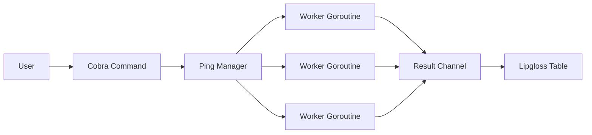

<div align="center">
  <h1>Go CLI Toolkit</h1>
  <p>Essential network and data utilities in a robust, concurrent, and extensible CLI.</p>

  

  <br>

  
  [](https://goreportcard.com/report/github.com/ESousa97/go-cli-toolkit)
  [](https://www.codefactor.io/repository/github/ESousa97/go-cli-toolkit)
  
  
  
  
</div>

---

> [!IMPORTANT]
> **This repository is archived.** It represents my initial journey into the **Go** language and serves as a personal study reference for language fundamentals, concurrency patterns, and CLI architecture.

**Go CLI Toolkit** is a collection of command-line tools designed to demonstrate advanced concurrency and extreme modularization in Go. It is ideal for daily task automation and rapid distributed environment validation.

## Repository Purpose

This project was built as part of my Go learning path, focusing on:
- **Fundamentals:** Strong typing, interfaces, and the *Standard Go Project Layout*.
- **Concurrency:** Practical use of *Goroutines*, *Channels*, and *WaitGroups*.
- **CLI Tooling:** Integration with industry-leading frameworks (Cobra and Viper).
- **Code Quality:** Implementation of unit tests, CI/CD pipelines, and professional documentation.

## Demonstration

### Concurrent Ping
Check multiple hosts simultaneously with easy-to-read visual status:

```bash
tk ping google.com github.com localhost:8080
```

Output:
```text
Starting ping for 3 hosts...

┌────────────┬────────┬────┬─────────┐
│HOST        │STATUS  │CODE│DETAILS  │
├────────────┼────────┼────┼─────────┤
│google.com  │ ONLINE │200 │OK       │
│github.com  │ ONLINE │200 │OK       │
│localhost   │ OFFLINE│--- │refused  │
└────────────┴────────┴────┴─────────┘
```

### JSON Formatter
Transform messy JSON into readable structures (pretty-print):

```bash
echo '{"id":1,"status":"ok"}' | tk format json
```

## Tech Stack

| Technology | Role |
|------------|-------|
| **Go 1.25** | High-performance language with native concurrency |
| **Cobra CLI** | Industrial-grade command and subcommand framework |
| **Viper** | Flexible configuration management (YAML/Env) |
| **Lipgloss** | Terminal styling and table rendering |
| **Testify** | Unit testing suite and assertions |

## Prerequisites

- **Go >= 1.25**
- **Make** (optional, for build convenience)

## Installation and Usage

### As a binary

```bash
go install github.com/ESousa97/go-cli-toolkit/cmd/tk@latest
```

### From source

```bash
git clone https://github.com/ESousa97/go-cli-toolkit.git
cd go-cli-toolkit
make build
make install
```

## Makefile Targets

| Target | Description |
|--------|-----------|
| `make build` | Compiles the binary locally (`tk`) |
| `make test` | Runs the full unit test suite |
| `make install` | Installs the binary to your `$GOPATH/bin` |
| `make clean` | Removes build artifacts and temporary files |
| `make run` | Executes the CLI in fast-compile mode |

## Architecture

The project follows the **Standard Go Project Layout**, separating responsibilities between `cmd/` and `internal/`.

### Concurrency Strategy
The `ping` command utilizes the *Fan-out* model to dispatch HTTP requests in isolated Goroutines, synchronized by a `sync.WaitGroup` and collected via a thread-safe `channel`.



## API Reference

Detailed documentation for interfaces and types is available at [pkg.go.dev/github.com/ESousa97/go-cli-toolkit](https://pkg.go.dev/github.com/ESousa97/go-cli-toolkit).

## Configuration

The system uses `config.yaml` to persist user preferences.

| Key | Description | Type | Default |
|-------|-----------|------|---------|
| `hosts` | List of favorite URLs for the ping command | `[]string` | `[]` |

## Roadmap (Historical)

Milestones achieved during development:

- [x] **Phase 1: Foundation** — Cobra structure + initial `ping` command.
- [x] **Phase 2: Data Manipulation** — `format json` subcommand with stdin support.
- [x] **Phase 3: Performance** — Refactoring for concurrency (Goroutines/Channels).
- [x] **Phase 5: Governance and Documentation** (Complete)
    - [x] Professional doc suite (README, CONTRIBUTING, LICENSE).
    - [x] Godoc documentation (100% export coverage).
    - [x] GitHub Actions (CI) and Quality Badges.

## Contributing

> [!NOTE]
> This project is **archived**. New Pull Requests are not being reviewed at this time, but feel free to **Fork** the code for your own studies.

## License

This project is licensed under the **MIT License** — see the [LICENSE](LICENSE) file for details.

<div align="center">

## Author

**Enoque Sousa**

[](https://www.linkedin.com/in/enoque-sousa-bb89aa168/)
[](https://github.com/ESousa97)
[](https://enoquesousa.vercel.app)

**[⬆ Back to top](#go-cli-toolkit)**

Made with ❤️ by [Enoque Sousa](https://github.com/ESousa97)

**Project Status:** Archived (Study Reference)

</div>
