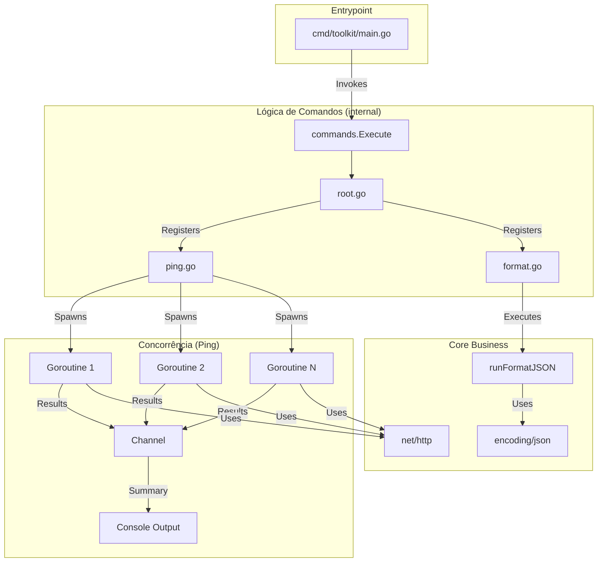

<div align="center">

# Go CLI Toolkit

[](https://www.codefactor.io/repository/github/ESousa97/go-cli-toolkit)
[](https://opensource.org/licenses/MIT)
[](#)

**Projeto educacional para prática e construção de uma Interface de Linha de Comando (CLI) utilitária em Go — construído com o framework Cobra CLI, seguindo as premissas do Standard Go Project Layout. Organizado com ponto de entrada isolado em `cmd/` e lógica encapsulada em `internal/`, promovendo modularização extrema e arquitetura stateless.**

</div>

---

## Índice

- [Sobre o Projeto](#sobre-o-projeto)
- [Funcionalidades](#funcionalidades)
- [Tecnologias](#tecnologias)
- [Arquitetura](#arquitetura)
- [Estrutura do Projeto](#estrutura-do-projeto)
- [Começando](#começando)
  - [Pré-requisitos](#pré-requisitos)
  - [Instalação](#instalação)
  - [Uso](#uso)
- [Licença](#licença)
- [Contato](#contato)

---

## Sobre o Projeto

Projeto em Go para construção de uma Interface de Linha de Comando (CLI) com foco na implementação inicial estruturada seguindo os princípios absolutos de modularização extrema. O repositório foi organizado com padrão de produção, isolando dependências externas e lógica de negócio e entrada da aplicação.

O repositório prioriza:

- **Organização por Bounded Contexts** — Código fonte dividido em pacotes lógicos (`cmd/` para inicialização e `internal/commands/` para comandos CLI), evitando exportação de lógicas dependentes da aplicação.
- **Isolamento de Ponto de Entrada** — O `main.go` apenas invoca a CLI. Toda a configuração semântica de comandos fica restrita ao componente filho.
- **Gestão de Comandos com Cobra** — Gerenciador de comandos hierárquico, permitindo evolução rápida na adoção de subcomandos e _flags_.
- **Sem Magic Values** — Todas as definições dos comandos (uso, mensagem curta e longa, etc.) são providas via constantes fortemente tipadas.

---

## Funcionalidades

- **Comando Raiz (`toolkit`)** — Configuração inicial do entrypoint.
- **Subcomando `ping`** — Verifica se um ou mais hosts estão acessíveis através de requisições HTTP GET concorrentes (Goroutines).
- **Subcomando `format json`** — Lê um JSON (via arquivo ou stdin), valida sua estrutura e o imprime formatado (Pretty Print).

---

## Tecnologias


---

## Arquitetura



### Pacotes e Responsabilidades

| Pacote                 | Responsabilidade                                                                                   |
| ---------------------- | -------------------------------------------------------------------------------------------------- |
| `cmd/toolkit/main.go`  | Entrypoint do binário. Isola a função main() de regras de negócio.                                 |
| `internal/commands`    | Organiza os comandos e subcomandos utilizando Cobra CLI.                                           |
| `net/http` e `context` | Bibliotecas standard usadas para controle da rede com segurança (Timeout estrito contra gargalos). |

---

## Estrutura do Projeto

```
go-cli-toolkit/
├── cmd/
│   └── toolkit/
│       └── main.go                     # Entrypoint principal
├── internal/
│   └── commands/
│       ├── root.go                     # Comando base da CLI (Cobra Setup)
│       ├── ping.go                     # Implementação de 'ping'
│       └── format.go                   # Implementação de 'format json'
├── go.mod                              # Manifesto de dependências do Go
└── go.sum                              # Lock de checksum
```

---

## Começando

### Pré-requisitos

- Go 1.21+ (ou versão superior instalada localmente)
- Terminal/Prompt de Comando para interação

### Instalação

```bash
git clone https://github.com/sousa/go-cli-toolkit.git
cd go-cli-toolkit
go mod download
```

### Compilação do Binário

**Compilar na raiz do ecossistema:**

```bash
go build -o tk.exe ./cmd/toolkit
```

_(No Linux/macOS remova o `.exe`)_

### Uso

Para rodar ajuda da ferramenta raiz:

```bash
./tk.exe --help
```

### Ping

Executar o subcomando `ping` em múltiplos hosts de forma concorrente:

```powershell
.\tk.exe ping https://google.com https://github.com https://invalid.site.test
```

Exemplo de saída:
```text
Iniciando ping em 3 hosts...

[OK]   https://google.com (Status: 200)
[OK]   https://github.com (Status: 200)
[ERRO] https://invalid.site.test (host inacessível)

--- Resumo ---
Sucessos: 2
Falhas:   1
Total:    3
```

### Format JSON

Formatar um JSON bagunçado via arquivo:

```bash
./tk.exe format json --file raw.json
```

Ou via pipe stdin:

```bash
echo '{"name":"toolkit"}' | ./tk.exe format json
```

Exemplo de teste completo (criação, execução e limpeza):

```powershell
echo '{"name": "teste_final", "status": true}' > test.json; .\tk.exe format json --file test.json; rm test.json
```

Output esperado:

```json
{
  "name": "teste_final",
  "status": true
}
```

Testando caso de falha:

```bash
./tk.exe ping https://site.que.nao.existe
```

---

## Licença

Este projeto está sob a licença MIT. Veja o arquivo [LICENSE](LICENSE) para mais detalhes.

```
MIT License - você pode usar, copiar, modificar e distribuir este código.
```

---

## Contato

**Enoque Sousa**

[](https://www.linkedin.com/in/enoque-sousa-bb89aa168/)
[](https://github.com/ESousa97)
[](https://enoquesousa.vercel.app)

---

<div align="center">

**[⬆ Voltar ao topo](#go-cli-toolkit)**

Feito com ❤️ por [Enoque Sousa](https://github.com/ESousa97)

**Status do Projeto:** Ativo — Em constante atualização

</div>
