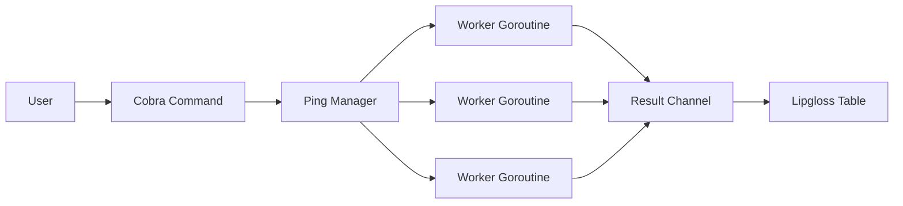

<div align="center">
  <h1>Go CLI Toolkit</h1>
  <p>Utilitários essenciais de rede e dados em uma CLI robusta, concorrente e extensível.</p>

  

  <br>

  
  [](https://goreportcard.com/report/github.com/ESousa97/go-cli-toolkit)
  [](https://www.codefactor.io/repository/github/ESousa97/go-cli-toolkit)
  
  
  
  
</div>

---

O **Go CLI Toolkit** é uma coleção de ferramentas de linha de comando projetadas para desenvolvedores que buscam eficiência no diagnóstico de rede e manipulação de dados. Construído em Go para performance máxima, o toolkit demonstra o uso avançado de concorrência e modularização extrema. Ideal para automação de tarefas diárias e validação rápida de ambientes distribuídos.

## Demonstração

### Ping Concorrente
Verifique múltiplos hosts simultaneamente com status visual de fácil leitura:

```bash
tk ping google.com github.com localhost:8080
```

Output:
```text
Iniciando ping em 3 hosts...

┌────────────┬────────┬────┬─────────┐
│HOST        │STATUS  │CODE│DETAILS  │
├────────────┼────────┼────┼─────────┤
│google.com  │ ONLINE │200 │OK       │
│github.com  │ ONLINE │200 │OK       │
│localhost   │ OFFLINE│--- │refused  │
└────────────┴────────┴────┴─────────┘
```

### Formatador JSON
Transforme JSONs bagunçados em estruturas legíveis (pretty-print):

```bash
echo '{"id":1,"status":"ok"}' | tk format json
```

## Stack Tecnológico

| Tecnologia | Papel |
|------------|-------|
| **Go 1.25** | Linguagem de alta performance e concorrência nativa |
| **Cobra CLI** | Framework de comandos e subcomandos de nível industrial |
| **Viper** | Gestão de configuração flexível (Yaml/Env) |
| **Lipgloss** | Estilização de terminais e renderização de tabelas |
| **Testify** | Suíte de testes unitários e asserções |

## Pré-requisitos

- **Go >= 1.25**
- **Make** (opcional, para conveniência de build)

## Instalação e Uso

### Como binário

```bash
go install github.com/ESousa97/go-cli-toolkit/cmd/tk@latest
```

### A partir do source

```bash
git clone https://github.com/ESousa97/go-cli-toolkit.git
cd go-cli-toolkit
make build
make install
```

## Makefile Targets

| Target | Descrição |
|--------|-----------|
| `make build` | Compila o binário localmente (`tk`) |
| `make test` | Executa a suíte completa de testes unitários |
| `make install` | Instala o binário no seu `$GOPATH/bin` |
| `make clean` | Remove artefatos de build e temporários |
| `make run` | Executa a CLI em tempo de compilação rápida |

## Arquitetura

O projeto segue o **Standard Go Project Layout**, dividindo responsabilidades entre `cmd/` e `internal/`.

### Estratégia de Concorrência
O comando `ping` utiliza o modelo de _Fan-out_ para despachar requisições HTTP em Goroutines isoladas, sincronizadas por um `sync.WaitGroup` e coletadas via `channel` thread-safe.



## API Reference

A documentação detalhada das interfaces e tipos está disponível em [pkg.go.dev/github.com/ESousa97/go-cli-toolkit](https://pkg.go.dev/github.com/ESousa97/go-cli-toolkit).

## Configuração

O sistema utiliza o arquivo `config.yaml` para persistir preferências do usuário.

| Chave | Descrição | Tipo | Padrão |
|-------|-----------|------|---------|
| `hosts` | Lista de URLs favoritas para o comando ping | `[]string` | `[]` |

## Roadmap

Acompanhe a evolução do projeto e as etapas de maturidade atingidas:

- [x] **Fase 1: Fundação** — Estrutura Cobra + primeiro comando `ping`.
- [x] **Fase 2: Manipulação de Dados** — Subcomando `format json` com suporte a stdin.
- [x] **Fase 3: Performance** — Refatoração para concorrência (Goroutines/Channels).
- [x] **Fase 5: Governança e Documentação** (Completo)
    - [x] Suite de doc profissional (README, CONTRIBUTING, LICENSE).
    - [x] Documentação Godoc (100% de cobertura nos exports).
    - [x] Implementação de GitHub Actions (CI) e Badges de Qualidade.

## Contribuindo

Interessado em ajudar? Veja nosso [CONTRIBUTING.md](CONTRIBUTING.md) para detalhes sobre o processo de Pull Request e padrões de código.

## Licença

Este projeto está licenciado sob a **MIT License** — veja o arquivo [LICENSE](LICENSE) para detalhes.

<div align="center">

## Autor

**Enoque Sousa**

[](https://www.linkedin.com/in/enoque-sousa-bb89aa168/)
[](https://github.com/ESousa97)
[](https://enoquesousa.vercel.app)

**[⬆ Voltar ao topo](#go-cli-toolkit)**

Feito com ❤️ por [Enoque Sousa](https://github.com/ESousa97)

**Status do Projeto:** Ativo — Em constante atualização

</div>
