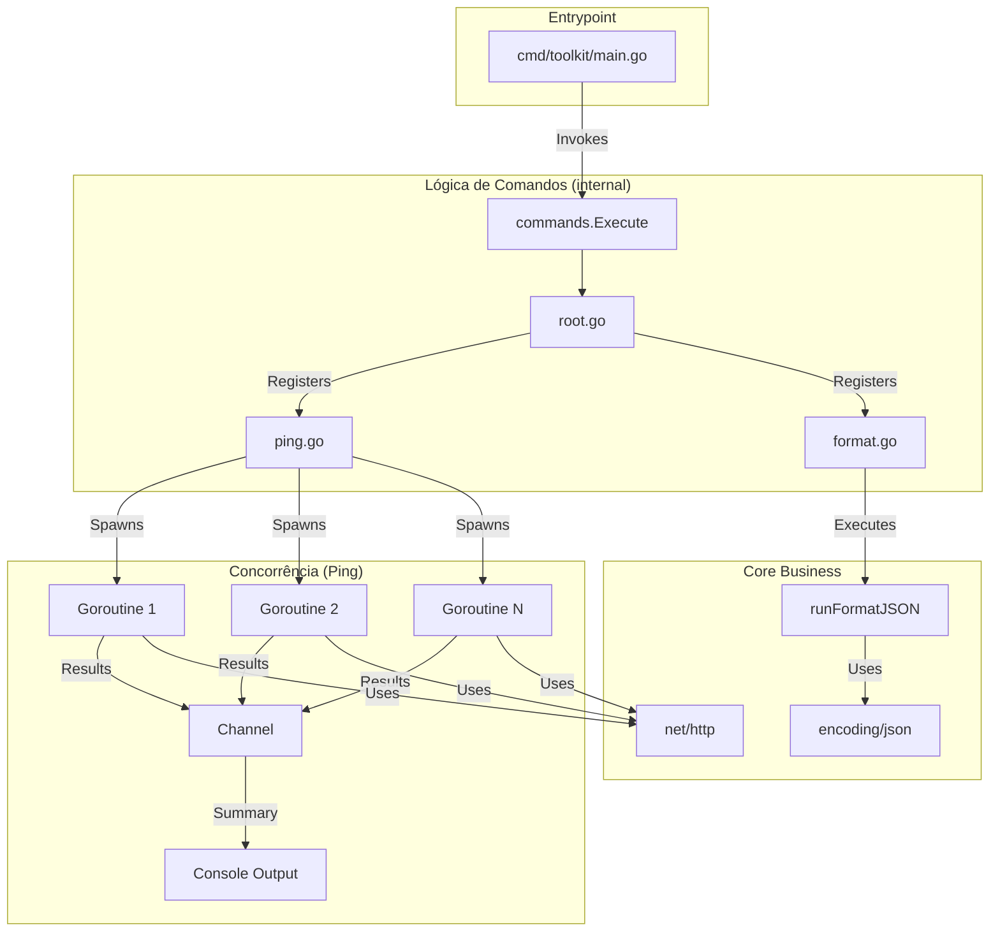

<div align="center">

# Go CLI Toolkit

[](https://www.codefactor.io/repository/github/ESousa97/go-cli-toolkit)
[](https://opensource.org/licenses/MIT)
[](#)

**Projeto educacional para prática e construção de uma Interface de Linha de Comando (CLI) utilitária em Go — construído com o framework Cobra CLI, seguindo as premissas do Standard Go Project Layout. Organizado com ponto de entrada isolado em `cmd/` e lógica encapsulada em `internal/`, promovendo modularização extrema e arquitetura stateless.**

</div>

---

## Índice

- [Sobre o Projeto](#sobre-o-projeto)
- [Funcionalidades](#funcionalidades)
- [Tecnologias](#tecnologias)
- [Arquitetura](#arquitetura)
- [Estrutura do Projeto](#estrutura-do-projeto)
- [Começando](#começando)
  - [Pré-requisitos](#pré-requisitos)
  - [Instalação](#instalação)
  - [Uso](#uso)
- [Licença](#licença)
- [Contato](#contato)

---

## Sobre o Projeto

Projeto em Go para construção de uma Interface de Linha de Comando (CLI) com foco na implementação inicial estruturada seguindo os princípios absolutos de modularização extrema. O repositório foi organizado com padrão de produção, isolando dependências externas e lógica de negócio e entrada da aplicação.

O repositório prioriza:

- **Organização por Bounded Contexts** — Código fonte dividido em pacotes lógicos (`cmd/` para inicialização e `internal/commands/` para comandos CLI), evitando exportação de lógicas dependentes da aplicação.
- **Isolamento de Ponto de Entrada** — O `main.go` apenas invoca a CLI. Toda a configuração semântica de comandos fica restrita ao componente filho.
- **Gestão de Comandos com Cobra** — Gerenciador de comandos hierárquico, permitindo evolução rápida na adoção de subcomandos e _flags_.
- **Sem Magic Values** — Todas as definições dos comandos (uso, mensagem curta e longa, etc.) são providas via constantes fortemente tipadas.

---

## Funcionalidades

- **Comando Raiz (`toolkit`)** — Configuração inicial do entrypoint com suporte a Viper.
- **Subcomando `ping`** — Verifica se um ou mais hosts estão acessíveis através de requisições HTTP GET concorrentes.
  - **Auto-Configuração:** Suporta lista de "hosts favoritos" via `config.yaml`.
  - **Saída Visual:** Tabela elegante formatada com Lipgloss (Cores dinâmicas: Verde para ONLINE, Vermelho para OFFLINE).
- **Subcomando `format json`** — Lê um JSON (via arquivo ou stdin), valida sua estrutura e o imprime formatado (Pretty Print).

---

## Tecnologias


---

## Arquitetura

O **Go CLI Toolkit** foi projetado seguindo os princípios inegociáveis do _Standard Go Project Layout_ e modularização extrema.

### 🐍 Por que escolhemos o Cobra CLI?

O framework [Cobra](https://github.com/spf13/cobra) foi adotado devido à sua dominância no ecossistema Go (utilizado extensivamente em projetos como Kubernetes, Docker e GitHub CLI). Ele proporciona:

- **Hierarquia Elegante:** Facilita muito o agrupamento lógico por Bounded Contexts em subcomandos isolados (ex: `toolkit format json`).
- **Desacoplamento de Ponto de Entrada:** Toda inicialização semântica e flags são encapsuladas em `internal/commands/root.go`, blindando o `main.go`.
- **Governança de Configuração:** Associar o Cobra ao _Viper_ permite externalizar todo o estado fixo para o `config.yaml`, garantindo configurações stateless.

### ⚡ Estratégia de Concorrência (Goroutines e Channels)

O comando Ping é estruturado para suportar o rastreamento em massa, evitando o bloqueio síncrono da interface quando hosts caem em timeouts densos (IO Bound).

1. Disparamos fluxos atômicos via **Goroutines** para processar a rede (`http.Client`) em paralelo.
2. Usamos `sync.WaitGroup` como **Barreira de Sincronização** aguardando a finalização cega de todos os workers.
3. Os resultados são coletados de forma unificada e thread-safe via um **Channel** de eventos tipados, que por fim é consumido pelo renderizador passivo de terminal (Lipgloss).



### Pacotes e Responsabilidades

| Pacote                 | Responsabilidade                                                                                   |
| ---------------------- | -------------------------------------------------------------------------------------------------- |
| `cmd/toolkit/main.go`  | Entrypoint do binário. Isola a função main() de regras de negócio.                                 |
| `internal/commands`    | Organiza os comandos e subcomandos utilizando Cobra CLI.                                           |
| `net/http` e `context` | Bibliotecas standard usadas para controle da rede com segurança (Timeout estrito contra gargalos). |

---

## Estrutura do Projeto

```
go-cli-toolkit/
├── cmd/
│   └── toolkit/
│       └── main.go                     # Entrypoint principal
├── internal/
│   └── commands/
│       ├── root.go                     # Comando base da CLI (Cobra Setup)
│       ├── ping.go                     # Implementação de 'ping'
│       └── format.go                   # Implementação de 'format json'
├── go.mod                              # Manifesto de dependências do Go
└── go.sum                              # Lock de checksum
```

---

## Começando

### Pré-requisitos

- Go 1.21+ (ou versão superior instalada localmente)
- Terminal/Prompt de Comando para interação

### Instalação

```bash
git clone https://github.com/sousa/go-cli-toolkit.git
cd go-cli-toolkit
go mod download
```

### 🚀 Testes Rápidos (Copie e Cole)

Quer ver a ferramenta em ação sem precisar fazer o build manual? Abra seu terminal na raiz do projeto e cole os ambientes prontos para testar as dependências (**Lipgloss** e **Viper**):

**1. Ping Concorrente (Múltiplas URLs)**
Teste o rastreio concorrente via _Goroutines_, formatado na tabela elegante do Lipgloss:

```bash
go run cmd/toolkit/main.go ping google.com github.com localhost:12345
```

**2. Sistema de "Hosts Favoritos" (Viper)**
O toolkit tenta ler um `config.yaml` caso não receba parâmetros manuais. Exemplo interativo de criação e teste:

#### _No macOS / Linux / Git Bash:_

```bash
echo -e "hosts:\n  - google.com\n  - inexistent.local.test" > config.yaml
go run cmd/toolkit/main.go ping
```

#### _No Windows (PowerShell):_

```powershell
"hosts:`n  - google.com`n  - inexistent.local.test" | Out-File config.yaml -Encoding utf8
go run cmd/toolkit/main.go ping
```

**3. Formatador JSON (Pretty Print)**
Crie um arquivo JSON numa linha na máquina e o exiba reformatado (Pretty Print) logo na sequência:

#### _No macOS / Linux / Git Bash:_

```bash
echo '{"projeto":"Go CLI","status":"ativo","recursos":["ping","format"]}' > raw.json
go run cmd/toolkit/main.go format json --file raw.json
rm raw.json
```

#### _No Windows (PowerShell):_

```powershell
'{"projeto":"Go CLI","status":"ativo","recursos":["ping","format"]}' > raw.json
go run cmd/toolkit/main.go format json --file raw.json
rm raw.json
```

### Compilação do Binário

**Compilar na raiz do ecossistema:**

```bash
go build -o tk.exe ./cmd/toolkit
```

_(No Linux/macOS remova o `.exe`)_

### Uso

Para rodar ajuda da ferramenta raiz:

```bash
./tk.exe --help
```

### Ping

Executar o subcomando `ping` em múltiplos hosts de forma concorrente:

```powershell
.\tk.exe ping google.com github.com
```

**Dica:** Se você não passar argumentos, o Toolkit usará os hosts definidos em seu `config.yaml`:

```yaml
hosts:
  - google.com
  - seu-servidor.com
```

Exemplo de saída visual:

```text
Iniciando ping em 2 hosts...

┌────────────┬────────┬────┬─────────┐
│HOST        │STATUS  │CODE│DETAILS  │
├────────────┼────────┼────┼─────────┤
│google.com  │ ONLINE │200 │OK       │
│github.com  │ ONLINE │200 │OK       │
└────────────┴────────┴────┴─────────┘

--- Resumo ---
Sucessos: 2
Falhas:   0
Total:    2
```

### Format JSON

Formatar um JSON bagunçado via arquivo:

```bash
./tk.exe format json --file raw.json
```

Ou via pipe stdin:

```bash
echo '{"name":"toolkit"}' | ./tk.exe format json
```

Exemplo de teste completo (criação, execução e limpeza):

```powershell
echo '{"name": "teste_final", "status": true}' > test.json; .\tk.exe format json --file test.json; rm test.json
```

Output esperado:

```json
{
  "name": "teste_final",
  "status": true
}
```

Testando caso de falha:

```bash
./tk.exe ping https://site.que.nao.existe
```

---

## 🤝 Como Contribuir

Ficou interessado em expandir este kit de ferramentas? Contribuições são imensamente encorajadas!

Siga nosso fluxo de governança padronizado:

1. Faça um **Fork** do ecossistema e navegue até a raiz do novo repositório.
2. Crie sua branch de _feature_ focada no seu domínio (`git checkout -b feature/minha-ferramenta-poderosa`).
3. Atenha-se às nossas Premissas de Código:
   - **Módulos Limpos:** Responsabilidade única. Crie subcomandos pequenos.
   - **Inversões e Padrões:** Faça o isolamento entre lógica core (interfaces) e entrada IO.
   - **Sem Magic Values:** Extraia strings, cores, e limites de espera para variáveis ou arquivos de configuração (Viper).
4. Assegure a garantia de qualidade executando a suíte local via `make test`. (Nada avança sem rodar verde!)
5. Faça seus _commits_ de forma atômica e abra um **Pull Request**.

---

## Licença

Este projeto está sob a licença MIT. Veja o arquivo [LICENSE](LICENSE) para mais detalhes.

```
MIT License - você pode usar, copiar, modificar e distribuir este código.
```

---

## Contato

**Enoque Sousa**

[](https://www.linkedin.com/in/enoque-sousa-bb89aa168/)
[](https://github.com/ESousa97)
[](https://enoquesousa.vercel.app)

---

<div align="center">

**[⬆ Voltar ao topo](#go-cli-toolkit)**

Feito com ❤️ por [Enoque Sousa](https://github.com/ESousa97)

**Status do Projeto:** Ativo — Em constante atualização

</div>
